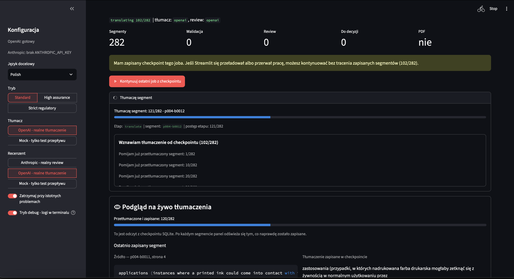

# TechnicAl PDF Translator

<p align="center">
  
</p>

[](https://github.com/xsub/TechnicAl-PDF-Translator/actions/workflows/tests.yml)

Cross-language tech PDF translator for audited, human-in-the-loop translation of technical documents.

TechnicAl is a minimal document workflow for translating technical PDFs between arbitrary source and target languages. The default setup is English → Polish, but the UI supports a long searchable language list and custom language names. The project is intentionally more of a controlled pipeline than a fully autonomous agent: the LLM translates meaning, deterministic code protects numbers and identifiers, a second model reviews the output, and the operator resolves only the fragments that need human judgment.

#AI #PDF #TechnicalTranslation #Streamlit #LangGraph #OpenAI #Anthropic #HumanInTheLoop #TranslationMemory #DocumentAutomation

## App preview



The UI shows the current job checkpoint, debug/status feedback for the active segment, and a live preview of translations already saved to SQLite.

## MVP features

- digital PDF extraction without OCR,
- segmentation of paragraphs and simple tables,
- PL/EN UI language switch,
- arbitrary source and target language selection from a searchable list, with custom language input,
- domain glossary in `translator/domain/glossary.yaml`,
- deterministic protection of numbers, units, comparators, CAS numbers, standards, regulations and lab abbreviations,
- mock translator/reviewer mode for demos without API keys,
- OpenAI adapter for real translation,
- Anthropic or OpenAI adapter for independent review,
- exact-match translation memory within the current job/checkpoint,
- persistent SQLite translation cache across jobs and app restarts,
- optional LangGraph workflow structure,
- Streamlit UI for progress, live translation preview, issues and operator decisions,
- output PDF generation with ReportLab,
- output PDF verification by extracting the generated PDF text again,
- JSON audit report and minimal SQLite job storage.

## Quick start

```bash
python -m venv .venv
source .venv/bin/activate
python -m pip install -e ".[dev]"
```

Run the UI:

```bash
streamlit run app.py
```

Run the CLI in mock/demo mode:

```bash
technical-pdf-translator path/to/input.pdf \
  --source-language English \
  --target-language Polish \
  --auto-accept-unresolved
```

For real model calls, create a local `.env` file or export:

```bash
OPENAI_API_KEY=...
ANTHROPIC_API_KEY=...
OPENAI_TRANSLATION_MODEL=gpt-5-mini
OPENAI_REVIEW_MODEL=gpt-5-mini
ANTHROPIC_REVIEW_MODEL=claude-sonnet-4-5
TRANSLATOR_DEBUG=true
```

Then choose `OpenAI` as translator and `Anthropic` or `OpenAI` as reviewer in the UI.

## Docker

The image does not copy `.env` or local `storage/` into the container. Pass secrets through `--env-file` and mount `storage/` for uploaded PDFs, checkpoints and outputs:

```bash
docker build -t technical-pdf-translator .
mkdir -p storage
docker run --rm \
  --env-file .env \
  -p 8501:8501 \
  -v "$PWD/storage:/app/storage" \
  technical-pdf-translator
```

Open:

```text
http://localhost:8501
```

If you build with Podman and want the `HEALTHCHECK` preserved in the image metadata, use Docker format:

```bash
podman build --format docker -t technical-pdf-translator .
```

## GitHub CI

This repository includes GitHub Actions testing in `.github/workflows/tests.yml`.

The CI workflow runs on pushes to `main` and pull requests:

```bash
python -m compileall app.py translator tests
python -m unittest
```

The tests use only local PDF/Pydantic dependencies and do not require API keys.

## Design notes

TechnicAl generates a new PDF that preserves the document structure, but it does not try to reproduce the original layout pixel-for-pixel. This is deliberate: translated text can be longer or shorter than the source, so identical layout and no text compression are often conflicting requirements.

The current domain glossary is Polish-oriented. When the target language is Polish/Polski/pl, approved Polish terms are validated as required. For other target languages, the glossary acts as a domain concept anchor for the model, but the deterministic validator does not force Polish equivalents.

Translation memory is intentionally conservative. It only reuses exact source-segment matches after whitespace normalization. It does not do fuzzy matching or semantic similarity, because in technical documents a similar sentence can mean something different in a different context.

The persistent translation cache lives in `storage/jobs.db` next to job checkpoints. Before sending a segment to the LLM, TechnicAl checks:

1. already translated segments in the current checkpoint,
2. identical segments translated earlier in the same job,
3. identical segments from the persistent SQLite translation cache,
4. the LLM only if all cache lookups miss.

Cache keys include the normalized source segment, source language, target language, domain, translator provider/model, glossary hash and translator prompt hash. This keeps reuse fast but avoids mixing translations created under different language or terminology settings.

Out of scope for the first MVP:

- full OCR pipeline,
- pixel-perfect layout reconstruction,
- RAG over historical documents,
- two full independent translations of every segment,
- fuzzy translation memory.

## Repository structure

```text
translator/
  graph.py                  # optional LangGraph compilation
  workflow.py               # main MVP runner
  schemas.py                # Pydantic schemas: segments, translations, reviews, reports
  nodes/                    # workflow steps
  pdf/                      # parser, renderer, output validator
  llm/                      # mock + OpenAI/Anthropic adapters
  domain/                   # glossary, prompts, protected value logic
  storage.py                # SQLite + JSON report
```

## Tests

```bash
python -m unittest
```
